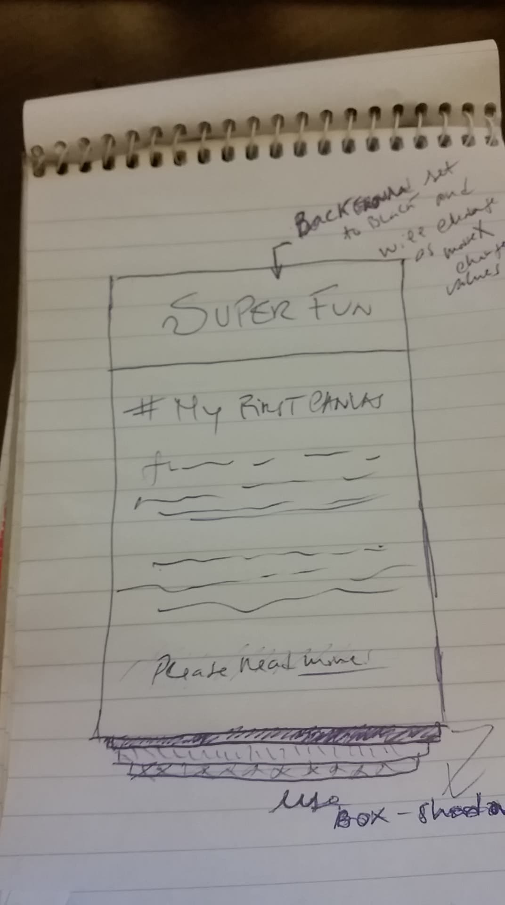

# Build a Card using a Canvas as main heading

> With main focus on the Canvas

### Table of Contents

- [Description](#description)
- [Technologies](#technologies)
- [license](#license)
- [Author Info](#author-info)

---

## Description

This project is the result of watching the _p5.js tutorials for beginners_ series on Youtube, by Daniel Shiffman, from Codingtrain channel. Even though I am still halfway through, I have felt condfident enough to embrace my first project involving p5.js

p5.js is a javascript library that enables any artistic mind to sketch out ideas he/she may have. It comes with several built-in functions and is well-documented, which makes programming a bit easier. 

I confess that I had a lot of fun setting up this project. Up to date, I was using a p5.js online editor which has everything set up for you. You only have to ceod. But having to set it up your own from scratch, as I am using my habitual text editor, made understand how to bring up the initial structure (i.e. appropriate links that go inside html head element, have the two main functions (setup and draw) and have in mind the fact that setup only runs once, while draw is infinitely running, as a loop). 

First thing, once all set up, I focused on the Canvas and what I wanted to achieve with it: set the background color to black, get a string that says (Super Fun) and set the color to white, size 30 and family font Arial; then, enabling the user to mouse hover, in the axis (horizontal), from one side to another of the canvas. And as the mouxeX (built-in variable that tracks current mouse position) updates its value, the background color and text fill color change accordingly. So, it was great fun to find the best solution for the time being; using map() function has enabled the mouseX to have the background color range values mapped to the mouseX range values, for example. 

Now, not all are roses, and so I got stuck when trying to tell mouseX only to get fired within the canvas. At this point, the mouseX is accessed from where the canvas begins but inside or outside of the Canvas. I did not want that. I knew I should use a condition that would say, listen! when mouseX is at this point please stop him from being fired. I refered to documentation to understand how mouseX works but still no solution had occured to me so I went to look for help in a JavaScript slack workspace I have recently joined in. Only one programmer at that time was able to help me. When I finally reached to the solution, the feelings I had were, and still are, impossible to describe. It's more than joy. Its a feeling of you being reward for something you get done with scrifice and sky-is-the-limit state of mind.

Last, but not least, I would like to highlight the fact that I can feel the difference between my first project and this one here, my last one. Be it using the developer tools, text editor or structure a project. I know more what I am doing; my code is cleaner; the comments are more objective and easier to understand and decision making has improved a lot. I am looking forward to my next project!  

#### Technologies

- Html
- Css
- JavaScript
- Command line (WSL and Cmd)
- Git/Github
- Markdown 
- Visual Studio
- Chrome Dev Tools
- Slack
- Mozilla Developer Network
- p5.js reference

[Back to the top](#build-a-Card-using-a-Canvas-as-main-heading)

## License 

Copyright (c) [2018] [Helio Goncalves]

Permission is hereby granted, free of charge, to any person obtaining a copy of this software and associated documentation files (the "Software"), to deal in the Software without restriction, including without limitation the rights to use, copy, modify, merge, publish, distribute, sublicense, and/or sell copies of the Software, and to permit persons to whom the Software is furnished to do so, subject to the following conditions:

The above copyright notice and this permission notice shall be included in all copies or substantial portions of the Software.

THE SOFTWARE IS PROVIDED "AS IS", WITHOUT WARRANTY OF ANY KIND, EXPRESS OR IMPLIED, INCLUDING BUT NOT LIMITED TO THE WARRANTIES OF MERCHANTABILITY, FITNESS FOR A PARTICULAR PURPOSE AND NONINFRINGEMENT. IN NO EVENT SHALL THE AUTHORS OR COPYRIGHT HOLDERS BE LIABLE FOR ANY CLAIM, DAMAGES OR OTHER LIABILITY, WHETHER IN AN ACTION OF CONTRACT, TORT OR OTHERWISE, ARISING FROM, OUT OF OR IN CONNECTION WITH THE SOFTWARE OR THE USE OR OTHER DEALINGS IN THE SOFTWARE.

[Back to the top](#build-a-Card-using-a-Canvas-as-main-heading)

---

## Author Info

- GitHub - [github.com/srlhyo](https://github.com/srlhyo)
- LinkedIn - [Helio Goncalves](https://www.linkedin.com/in/helio-goncalves/) 

[Back to the top](#build-a-Card-using-a-Canvas-as-main-heading)